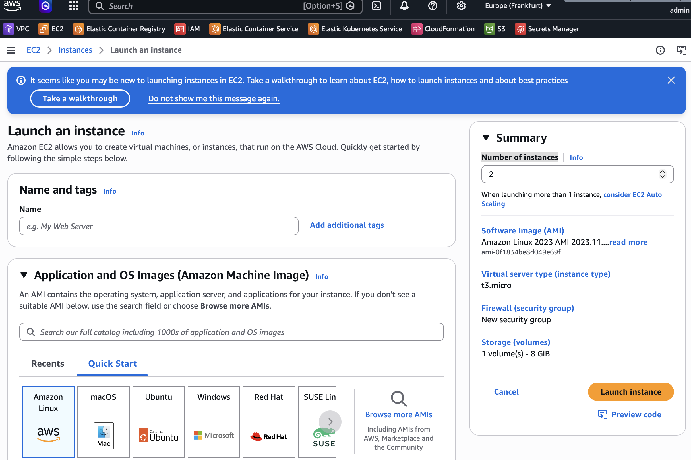
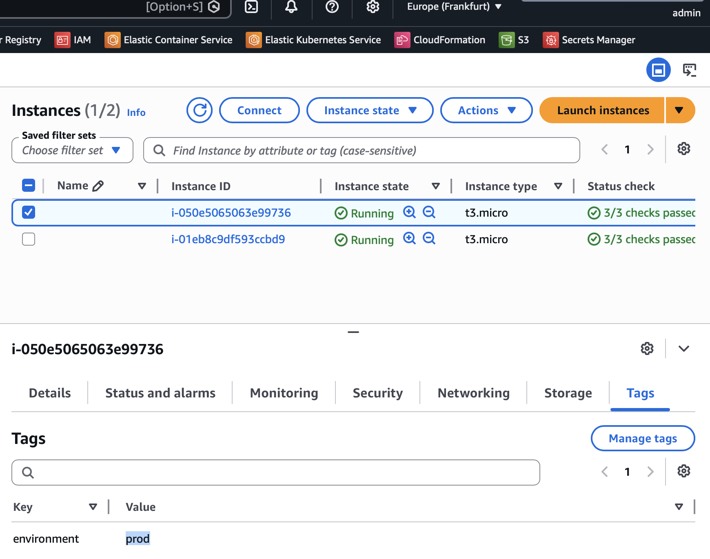
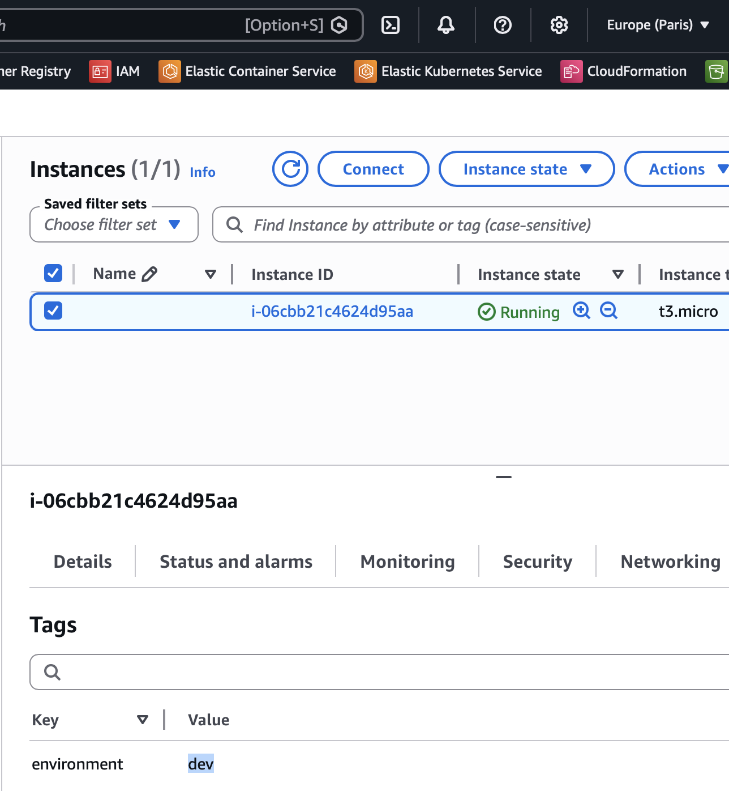

# Module 14 - Automation with Python

This repository contains a demo project created as part of my **DevOps studies** in the [TechWorld with Nana – DevOps Bootcamp](https://www.techworld-with-nana.com/devops-bootcamp).

**Demo Project:** Automate configuring EC2 Server Instances

**Technologies used:** Python, Boto3, AWS

**Project Description:**

- Write a Python script that automates adding environment tags to all EC2 Server instances

---

## Prerequisites

Install Python dependencies with [uv](https://docs.astral.sh/uv/):

```shell
uv sync
```

Configure AWS credentials at `~/.aws/credentials`:

```conf
[default]
aws_access_key_id = AKIA...
aws_secret_access_key = ...
```

And the default region at `~/.aws/config`:

```conf
[default]
region = us-east-1
```

---

## Create EC2 instances manually

Navigate to **AWS Dashboard → EC2 → Launch instances**.

### 1. Launch 2 instances in Frankfurt

- **Region:** Europe (Frankfurt) — `eu-central-1`
- **Number of instances:** `2`
- Leave all other settings at their defaults.



### 2. Launch 1 instance in Paris

- **Region:** Europe (Paris) — `eu-west-3`
- **Number of instances:** `1`
- Leave all other settings at their defaults.

---

## Execute the Python script

The script tags Frankfurt instances as `environment=prod` and Paris instances as `environment=dev`.

Source: [add-env-tags.py](./add-env-tags.py)

Run:

```sh
python3 ./add-env-tags.py
```

> A successful run produces no output.

### Verify the tags in the EC2 dashboard

For each instance, open **Instance → Tags** and confirm the `environment` tag is set.

**Frankfurt** (`environment=prod`):



**Paris** (`environment=dev`):



---

## Clean up created instances
